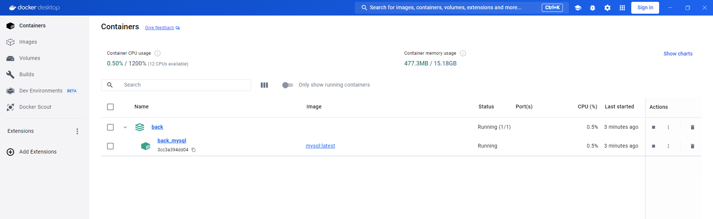
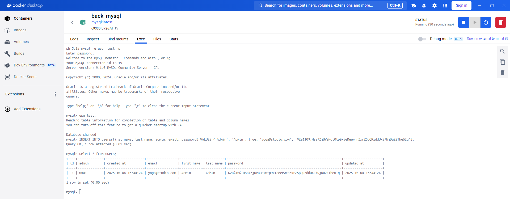

# Yoga App !

Backend de l'application Yoga App !.


## Configuration du back

    - name: back
    - port: 8080

## Pré-requis pour le bon fonctionnement du back :

    -> JDK 21
    -> Docker
    -> Docker Compose
    -> Maven 3.9.3 (https://archive.apache.org/dist/maven/maven-3/3.9.3/binaries/) ou plus

## Démarrage du back
Pour démarrer le back, il :
- démarrer Docker-Desktop sur votre poste de travail local.
- lancer une console, se placer à la racine du projet et exécuter la commande Maven :
```
mvn spring-boot:run
```
Cette commande va :
- initialiser le container Docker qui contient la base de données
- lancer l'application back et le connecter à la base de données précédemment créée

Les traces logs devraient ressemblées à ceci :
```
  .   ____          _            __ _ _
 /\\ / ___'_ __ _ _(_)_ __  __ _ \ \ \ \
( ( )\___ | '_ | '_| | '_ \/ _` | \ \ \ \
 \\/  ___)| |_)| | | | | || (_| |  ) ) ) )
  '  |____| .__|_| |_|_| |_\__, | / / / /
 =========|_|==============|___/=/_/_/_/

 :: Spring Boot ::                (v3.5.5)

[back] [           main] c.o.s.SpringBootSecurityJwtApplication   : Starting SpringBootSecurityJwtApplication using Java 21.0.3 with PID 15152
[back] [           main] c.o.s.SpringBootSecurityJwtApplication   : No active profile set, falling back to 1 default profile: "default"
[back] [           main] .s.b.d.c.l.DockerComposeLifecycleManager : Using Docker Compose file E:\dev\workspaces\missionOC\projet-p4\back\compose.yaml
[back] [utReader-stderr] o.s.boot.docker.compose.core.DockerCli   :  Container back_mysql  Created
[back] [utReader-stderr] o.s.boot.docker.compose.core.DockerCli   :  Container back_mysql  Starting
[back] [utReader-stderr] o.s.boot.docker.compose.core.DockerCli   :  Container back_mysql  Started
[back] [utReader-stderr] o.s.boot.docker.compose.core.DockerCli   :  Container back_mysql  Waiting
[back] [utReader-stderr] o.s.boot.docker.compose.core.DockerCli   :  Container back_mysql  Healthy
[back] [           main] .s.d.r.c.RepositoryConfigurationDelegate : Bootstrapping Spring Data JPA repositories in DEFAULT mode.
[back] [           main] .s.d.r.c.RepositoryConfigurationDelegate : Finished Spring Data repository scanning in 58 ms. Found 3 JPA repository interfaces.
[back] [           main] o.s.b.w.embedded.tomcat.TomcatWebServer  : Tomcat initialized with port 8080 (http)
[back] [           main] o.apache.catalina.core.StandardService   : Starting service [Tomcat]
[back] [           main] o.apache.catalina.core.StandardEngine    : Starting Servlet engine: [Apache Tomcat/10.1.44]
[back] [           main] o.a.c.c.C.[Tomcat].[localhost].[/]       : Initializing Spring embedded WebApplicationContext
[back] [           main] w.s.c.ServletWebServerApplicationContext : Root WebApplicationContext: initialization completed in 1360 ms
[back] [           main] o.hibernate.jpa.internal.util.LogHelper  : HHH000204: Processing PersistenceUnitInfo [name: default]
[back] [           main] org.hibernate.Version                    : HHH000412: Hibernate ORM core version 6.6.26.Final
[back] [           main] o.h.c.internal.RegionFactoryInitiator    : HHH000026: Second-level cache disabled
[back] [           main] o.s.o.j.p.SpringPersistenceUnitInfo      : No LoadTimeWeaver setup: ignoring JPA class transformer
[back] [           main] com.zaxxer.hikari.HikariDataSource       : HikariPool-1 - Starting...
[back] [           main] com.zaxxer.hikari.pool.HikariPool        : HikariPool-1 - Added connection com.mysql.cj.jdbc.ConnectionImpl@16cb6f51
[back] [           main] com.zaxxer.hikari.HikariDataSource       : HikariPool-1 - Start completed.
[back] [           main] org.hibernate.orm.connections.pooling    : HHH10001005: Database info:
	Database JDBC URL [Connecting through datasource 'HikariDataSource (HikariPool-1)']
	Database driver: undefined/unknown
	Database version: 9.1
	Autocommit mode: undefined/unknown
	Isolation level: undefined/unknown
	Minimum pool size: undefined/unknown
	Maximum pool size: undefined/unknown
[back] [           main] o.h.e.t.j.p.i.JtaPlatformInitiator       : HHH000489: No JTA platform available (set 'hibernate.transaction.jta.platform' to enable JTA platform integration)
[back] [           main] j.LocalContainerEntityManagerFactoryBean : Initialized JPA EntityManagerFactory for persistence unit 'default'
[back] [           main] eAuthenticationProviderManagerConfigurer : Global AuthenticationManager configured with AuthenticationProvider bean with name authenticationProvider
[back] [           main] r$InitializeUserDetailsManagerConfigurer : Global AuthenticationManager configured with an AuthenticationProvider bean. UserDetailsService beans will not be used by Spring Security for automatically configuring username/password login. Consider removing the AuthenticationProvider bean. Alternatively, consider using the UserDetailsService in a manually instantiated DaoAuthenticationProvider. If the current configuration is intentional, to turn off this warning, increase the logging level of 'org.springframework.security.config.annotation.authentication.configuration.InitializeUserDetailsBeanManagerConfigurer' to ERROR
[back] [           main] JpaBaseConfiguration$JpaWebConfiguration : spring.jpa.open-in-view is enabled by default. Therefore, database queries may be performed during view rendering. Explicitly configure spring.jpa.open-in-view to disable this warning
[back] [           main] o.s.b.w.embedded.tomcat.TomcatWebServer  : Tomcat started on port 8080 (http) with context path '/'
[back] [           main] c.o.s.SpringBootSecurityJwtApplication   : Started SpringBootSecurityJwtApplication in 10.354 seconds (process running for 11.197)
```

Sur Docker-Desktop, vous devriez voir apparaître un container MySQL qui correspond au projet.



Vous pouvez vous connecter à la base de données et vérifier que la table ```USERS``` a été créée.
Pour cela, cliquez sur le lien `back_mysql` ce qui vous amènera sur la vue complète de la base de données.
Dans l'onglet ```Exec```, il faut :

1. se connecter à la base de données. Tapez la commande ci-dessous

    ```
    mysql -u user_test -p
    ```
   L'invite de commande demandera le mot de passe. Il est : ```test_password```.


2. Se connecter au schéma de base de données `test`. Dans l'invite de commande, tapez la commande ci-dessous :

    ```
    use test;
    ```

3. Copier le contenu du fichier `ressources/sql/insert_user.sql` et l'exécuter dans l'invite de commande :

    ```
    INSERT INTO users(first_name, last_name, admin, email, password) VALUES ('Admin', 'Admin', true, 'yoga@studio.com', '$2a$10$.Hsa/ZjUVaHqi0tp9xieMeewrnZxrZ5pQRzddUXE/WjDu2ZThe6Iq');
    ```
   
3. Vérifier le contenu de la table `users`.

    ```
    select * from users;
    ```
   Le résultat devrait afficher les données de l'utilisateur inséré précédemment.
   
   Ce script crée l'utilisateur admin par défaut :

   - login: yoga@studio.com
   - password: test!1234

La capture d'écran ci-dessous résume les étapes précédentes :




## Ressources


### Collection Postman

Importez la collection Postman

> postman/yoga.postman_collection.json

La documentation de Postman se trouve ici :

https://learning.postman.com/docs/getting-started/importing-and-exporting-data/#importing-data-into-postman
# Yoga App – Backend API

API REST Spring Boot sécurisée par JWT pour la gestion de sessions de yoga (utilisateurs, enseignants, sessions, participations).

---

## Sommaire

- [Prérequis](#prérequis)
- [Installation et configuration](#installation-et-configuration)
- [Lancer l'application](#lancer-lapplication)
- [Lancer les tests](#lancer-les-tests)
- [Générer le rapport de couverture](#générer-le-rapport-de-couverture)
- [Structure des tests](#structure-des-tests)

---

## Prérequis

| Outil | Version minimale |
|---|---|
| Java (JDK) | 17 |
| Maven | 3.8+ (ou utiliser le wrapper `./mvnw`) |
| MySQL | 8.0+ |

---

## Installation et configuration

### 1. Cloner le dépôt

```bash
git clone <url-du-depot>
cd <nom-du-dossier>
```

### 2. Créer la base de données MySQL

Connectez-vous à MySQL et exécutez :

```sql
CREATE DATABASE yoga;
```

### 3. Configurer les accès à la base de données

Ouvrez `src/main/resources/application.properties` et adaptez les valeurs selon votre environnement :

```properties
spring.datasource.url=jdbc:mysql://localhost:3306/yoga?allowPublicKeyRetrieval=true
spring.datasource.username=root
spring.datasource.password=         # ← renseignez votre mot de passe
```

Les autres propriétés (JWT, Hibernate) sont déjà préconfigurées et n'ont pas besoin d'être modifiées pour un démarrage local.

### 4. Compiler le projet

```bash
mvn clean install -DskipTests
```

---

## Lancer l'application

```bash
mvn spring-boot:run
```

L'API est accessible à l'adresse : **http://localhost:8080**

### Endpoints principaux

| Méthode | Route | Accès | Description |
|---|---|---|---|
| POST | `/api/auth/register` | Public | Créer un compte |
| POST | `/api/auth/login` | Public | S'authentifier, obtenir un JWT |
| GET | `/api/session` | Authentifié | Lister les sessions |
| GET | `/api/session/{id}` | Authentifié | Détail d'une session |
| POST | `/api/session` | Authentifié | Créer une session |
| PUT | `/api/session/{id}` | Authentifié | Modifier une session |
| DELETE | `/api/session/{id}` | Authentifié | Supprimer une session |
| POST | `/api/session/{id}/participate/{userId}` | Authentifié | S'inscrire à une session |
| DELETE | `/api/session/{id}/participate/{userId}` | Authentifié | Se désinscrire |
| GET | `/api/teacher` | Authentifié | Lister les enseignants |
| GET | `/api/teacher/{id}` | Authentifié | Détail d'un enseignant |
| GET | `/api/user/{id}` | Authentifié | Détail d'un utilisateur |
| DELETE | `/api/user/{id}` | Propriétaire | Supprimer son compte |

> Pour les routes authentifiées, ajoutez le header HTTP :
> `Authorization: Bearer <votre_token_jwt>`

---

## Lancer les tests

Les tests sont divisés en deux catégories :

- **Tests unitaires** : isolés, rapides, sans base de données (Mockito)
- **Tests d'intégration** (`*IT.java`) : démarrent un contexte Spring complet avec une base H2 en mémoire (profil `test`)

### Lancer tous les tests

```bash
mvn test
```

### Lancer uniquement les tests unitaires

```bash
mvn test -Dtest="*Test"
```

### Lancer uniquement les tests d'intégration

```bash
mvn test -Dtest="*IT"
```

### Lancer les tests d'un package spécifique

```bash
# Tests des controllers
mvn test -Dtest="com.openclassrooms.starterjwt.controller.*"

# Tests des services
mvn test -Dtest="com.openclassrooms.starterjwt.service.*"

# Tests de la sécurité (JWT, filtres)
mvn test -Dtest="com.openclassrooms.starterjwt.security.*"

# Tests des mappers
mvn test -Dtest="com.openclassrooms.starterjwt.mapper.*"
```

### Lancer une seule classe de test

```bash
mvn test -Dtest="SessionControllerIT"
```

> Les tests d'intégration utilisent automatiquement le profil `test` (`src/test/resources/application-test.properties`), qui pointe vers une base H2 en mémoire. **Aucune installation supplémentaire n'est nécessaire pour les faire tourner.**

---

## Générer le rapport de couverture

Le projet utilise **JaCoCo** pour mesurer la couverture de code.

### Générer le rapport complet

```bash
mvn clean verify
```

Cette commande exécute tous les tests **et** génère le rapport HTML.

### Accéder au rapport

Une fois la commande terminée, ouvrez le fichier suivant dans votre navigateur :

```
target/site/jacoco/index.html
```

Le rapport présente la couverture par :

- **Package** — vue d'ensemble par couche (controller, service, mapper, security…)
- **Classe** — détail classe par classe
- **Méthode** — méthode par méthode
- **Ligne** — avec coloration rouge (non couverte) / verte (couverte) / jaune (branche partielle)

### Consulter le rapport en ligne de commande

```bash
# Résumé rapide dans le terminal après mvn verify
mvn jacoco:report
cat target/site/jacoco/index.html | grep -o 'Total[^<]*</td>' | head -5
```

---

## Structure des tests

```
src/test/java/com/openclassrooms/starterjwt/
│
├── controller/
│   ├── AbstractIntegrationTest.java       # Classe de base : contexte Spring + H2 + helpers JWT
│   ├── AuthControllerTest.java            # Tests unitaires (@WebMvcTest) : login, register
│   ├── AuthControllerIT.java              # Tests d'intégration : login, register
│   ├── SessionControllerIT.java           # Tests d'intégration : CRUD sessions, participation
│   ├── TeacherControllerIT.java           # Tests d'intégration : lecture enseignants
│   ├── UserControllerIT.java              # Tests d'intégration : lecture, suppression compte
│   └── GlobalExceptionHandlerTest.java    # Tests unitaires : codes HTTP des exceptions
│
├── service/
│   ├── SessionServiceTest.java            # Tests unitaires : logique métier sessions
│   ├── TeacherServiceTest.java            # Tests unitaires : logique métier enseignants
│   └── UserServiceTest.java               # Tests unitaires : logique métier utilisateurs
│
├── mapper/
│   ├── SessionMapperTest.java             # Tests unitaires : mapping SessionDto ↔ Session
│   ├── TeacherMapperTest.java             # Tests unitaires : mapping TeacherDto ↔ Teacher
│   └── UserMapperTest.java                # Tests unitaires : mapping UserDto ↔ User
│
└── security/
    ├── JwtUtilsTest.java                  # Tests unitaires : génération et validation JWT
    ├── AuthTokenFilterTest.java           # Tests unitaires : filtre d'authentification HTTP
    ├── AuthEntryPointJwtTest.java         # Tests unitaires : réponse 401 non autorisé
    ├── UserDetailsImplTest.java           # Tests unitaires : UserDetails Spring Security
    └── UserDetailsServiceImplTest.java    # Tests unitaires : chargement utilisateur par email
```
